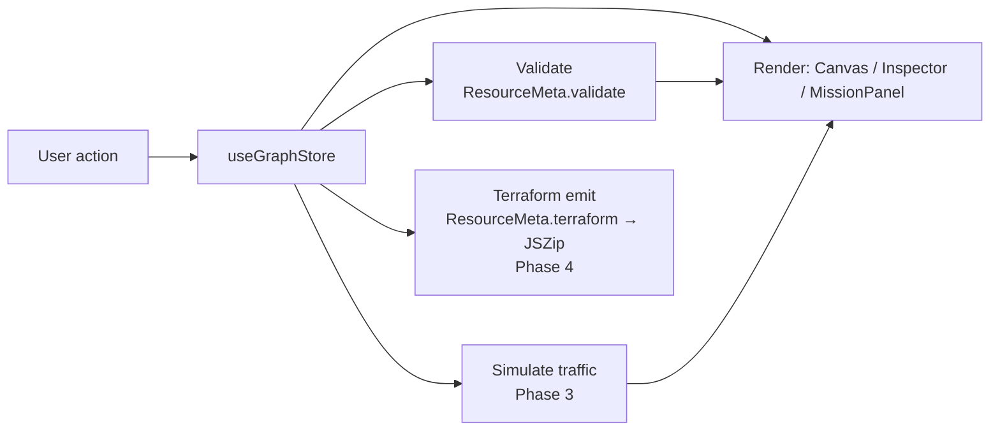

# Architecture

> **Draft.** This reflects the Phase 0 skeleton. It will be refined as
> simulation (Phase 3) and export (Phase 4) land.

## Overview

cidrunner is a client-only single-page app. There is no backend: the entire
editor, simulator, and Terraform generator run in the browser, and the build is
served as static files (GitHub Pages, under `/cidrunner/` — see
[ADR 0007](decisions/0007-github-pages-over-cloudflare.md)). State lives in memory in a single
Zustand store; nothing is persisted server-side.

The user builds an AWS topology as a graph of nodes (resources) and edges
(connections), optionally under a mission's win condition, then exports the
result as Terraform.

The UI language is **Korean**, hardcoded — no i18n framework. AWS resource names
and technical terms (VPC, Subnet, EC2, …) stay in English to match the AWS
console and docs. See [ADR 0008](decisions/0008-korean-first-ui-no-i18n.md).

## Component map

```
App
└─ Layout                     responsive shell (3-pane ≥md / drawers <md)
   ├─ Palette         (left)    draggable list of the 10 resource types
   ├─ Canvas          (center)  React Flow editor — nodes, edges, nesting
   │  └─ ResourceNode           one node renderer, driven by ResourceMeta
   ├─ Inspector       (right)   per-resource property form (Phase 2)
   ├─ MissionPanel    (right)   mission cards, active-mission state
   ├─ Toolbar         (top)     mode toggle · Start (sim) · Export (tf) — desktop only
   ├─ MobileHeader    (top)     <md drawer triggers (palette · missions · inspector)
   └─ Drawer          (<md)     overlay/bottom-sheet host for the three panels
```

| Component | Responsibility |
| --------- | -------------- |
| **Palette** | Lists `resourceList`; source of drag-and-drop node creation. |
| **Canvas** | Wraps React Flow; owns node/edge interaction, nesting, and (later) edge-rule enforcement. |
| **ResourceNode** | Generic node view; looks up its `ResourceMeta` by `data.type` to render icon, label, and accent. |
| **Inspector** | Edits the selected node's `data.config`; runs `ResourceMeta.validate` (Phase 2). |
| **MissionPanel** | Shows missions; sets `activeMissionId`; displays clear state (Phase 5). |
| **Toolbar** | Free/Challenge mode toggle; Start (Phase 3) and Export (Phase 4) actions. Desktop only (`hidden md:block`). |
| **MobileHeader** | `md:hidden` header buttons that open the palette / missions / inspector drawers. |
| **Drawer** | Self-contained overlay/bottom-sheet used to host the three panels below `md`. |

## Responsive strategy

The layout has two shells split at Tailwind's default `md` breakpoint (768px);
see [ADR 0009](decisions/0009-mobile-responsive-drawer-pattern.md).

- **≥768px (desktop)** — the static 3-pane layout above: Palette (left) /
  Canvas (center) / Inspector + MissionPanel (right).
- **<768px (mobile)** — Canvas fills the viewport (React Flow's built-in touch
  pan/zoom carries the "view" experience). The three panels become overlay
  drawers: Palette (left), Inspector (right), MissionPanel (bottom sheet,
  `max-h-[70vh]`), each opened from a `MobileHeader` button. Selecting a node
  auto-opens the Inspector drawer.

Each panel splits its inner content (`PaletteBody` / `InspectorBody` /
`MissionList`) from its desktop `aside` wrapper, so the desktop pane and the
mobile drawer render the same content with no duplication. Drawer open/close
state lives in the store as `mobileDrawers` + `setDrawer`.

The `Drawer` animates with **pure CSS transitions**, not Framer Motion: it stays
mounted and, when closed, is translated off-screen *and* `pointer-events-none`,
so a closed drawer can never intercept canvas taps regardless of animation
state. (An `AnimatePresence` version left a tap-blocking ghost overlay under
React 19 StrictMode — see the ADR.)

## State management

A single Zustand store, [`src/store/useGraphStore.ts`](../src/store/useGraphStore.ts),
is the source of truth:

- `mode` — `'free' | 'challenge'`
- `nodes` / `edges` — the React Flow graph (`nodes` typed as `ResourceNodeType`)
- `selectedNodeId` — drives the Inspector
- `activeMissionId` — drives the MissionPanel
- `mobileDrawers` — `{ palette, inspector, missions }` open flags for the `<md` drawers (`setDrawer`)
- `notice` — transient player-facing message for a rejected drop/edge (`setNotice`)

Nodes carry a typed `data` payload:

```ts
interface NodeData {
  type: ResourceType                 // which resource this block is
  label: string                      // display label
  config: Record<string, unknown>    // editable settings (seeded from defaults)
}
```

Nesting uses React Flow's native `parentId` + `extent: 'parent'` (a Subnet's
`parentId` is its VPC, and so on).

## Resource registry

[`src/resources/`](../src/resources/) holds one module per resource plus an
`index.ts` registry. Each resource is a `ResourceMeta` describing everything the
rest of the app needs to know about it — so the UI, validator, and Terraform
emitter stay data-driven rather than hard-coded per resource:

```ts
interface ResourceMeta {
  type: ResourceType
  label: string
  description: string
  icon: LucideIcon
  color: string
  defaults: Record<string, unknown>
  allowedParents: (ResourceType | 'canvas')[] // where it may be placed (nesting)
  container?: boolean                          // holds child nodes (VPC, Subnet)
  defaultSize?: { width; height }              // container size on create
  connectsTo?: ResourceType[]                  // directional edge targets
  fields?: PropertyField[]                     // Inspector form descriptor (Phase 2)
  terraform: (id, config) => string            // Phase 4 — stubbed
  validate?: (config) => string[]              // real-time validation (Phase 2)
}
```

The MVP set is fixed at **10** resources — see
[ADR 0001](decisions/0001-mvp-scope-and-resource-list.md).

## Property editing & validation

The Inspector's form is data-driven (Phase 2): `PropertyForm` reads a resource's
`fields` (`text` / `number` / `boolean` / `select`) and writes edits back through
the store's `updateNodeConfig`. `ResourceMeta.validate` runs on every render for
real-time feedback — errors show as a red badge + message list in the Inspector
and a red outline on the node. Reusable checks live in
[`src/resources/validators.ts`](../src/resources/validators.ts). Security Group
rules are simplified to inbound toggles — see
[ADR 0011](decisions/0011-inspector-property-form-and-validation.md).

## Graph rules

Nesting and edge constraints (Phase 1) are **data-driven**, derived entirely
from the `ResourceMeta` fields above so the canvas carries no per-resource
branching. [`src/graph/rules.ts`](../src/graph/rules.ts) exposes the derived
predicates — `canContain`, `canBeTopLevel`, `canConnect`, `canBeSource`,
`canBeTarget` — used by the canvas and node renderer:

- **Nesting** — a drop resolves the innermost container under the pointer whose
  type is in the dropped resource's `allowedParents`; if none matches it falls
  back to top level (when `'canvas'` is allowed) or is rejected. React Flow's
  native `parentId` + `extent: 'parent'` then keep children within their parent.
- **Edges** — a connection `source → target` is allowed only when the source's
  `connectsTo` lists the target's type; connection handles are rendered only
  where a node may be an edge source and/or target.
- **Feedback** — a rejected drop or edge sets a transient `notice` string in the
  store, surfaced as a toast over the canvas.

See [ADR 0010](decisions/0010-graph-nesting-and-edge-rule-model.md).

## Traffic simulation

Pressing **Start** runs [`src/graph/simulate.ts`](../src/graph/simulate.ts): a
greedy single-path trace from an entry node (ALB, else an unfed Lambda) along the
edges to a sink (RDS or S3). The `SimResult` (path node/edge ids, blocking node,
message) lives in the store as `simulation`. `TrafficEdge` renders a moving SVG
particle along each path edge (staggered per hop); path nodes glow green and the
blocking node pulses red, with a banner over the canvas. Scope is connectivity
only — security-group and routing rules are not modeled. See
[ADR 0012](decisions/0012-traffic-simulation-model.md).

## Mission registry

[`src/missions/`](../src/missions/) holds one module per mission
(`tutorial`, `threeTier`, `serverless`) plus an `index.ts`. A `Mission`
describes its `goal`, optional `hint`, and `requiredResources` used by the
Phase 3+ clear check.

## Data flow



1. A user action (drag, connect, edit, select) dispatches a store mutation.
2. The store update re-renders the affected panes.
3. Validation runs against the changed config and feeds error state back to the UI.
4. **Start** walks the graph topology to animate traffic and detect broken paths.
5. **Export** maps each node through its `terraform()` emitter, resolves
   dependencies from the graph topology (e.g. a Subnet's `vpc_id` from its
   parent), and zips the result — see
   [ADR 0005](decisions/0005-terraform-generation-approach.md).
