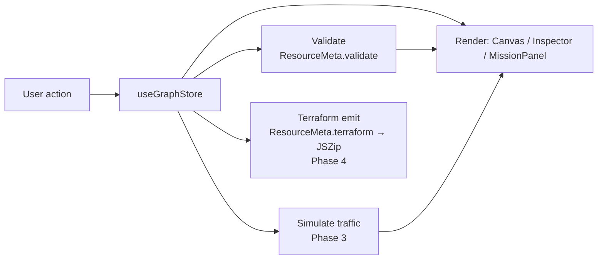

# Architecture

> Reflects the MVP (Phases 0–5): editor, property validation, traffic
> simulation, Terraform export, and the mission system.

## Overview

cidrunner is a client-only single-page app. There is no backend: the entire
editor, simulator, and Terraform generator run in the browser, and the build is
served as static files (GitHub Pages, under `/cidrunner/` — see
[ADR 0007](decisions/0007-github-pages-over-cloudflare.md)). State lives in memory in a single
Zustand store; nothing is persisted server-side.

The user builds an AWS topology as a graph of nodes (resources) and edges
(connections), optionally under a mission's win condition, then exports the
result as Terraform.

The UI language is **Korean**, hardcoded — no i18n framework. AWS resource names
and technical terms (VPC, Subnet, EC2, …) stay in English to match the AWS
console and docs. See [ADR 0008](decisions/0008-korean-first-ui-no-i18n.md).

## Component map

```
App
└─ Layout                     responsive shell (3-pane ≥md / drawers <md)
   ├─ Palette         (left)    searchable, draggable list of the 27 resource types
   ├─ Canvas          (center)  React Flow editor — nodes, edges, nesting
   │  └─ ResourceNode           one node renderer, driven by ResourceMeta
   ├─ Inspector       (right)   per-resource property form (Phase 2)
   ├─ MissionPanel    (right)   mission cards, active-mission state
   ├─ Toolbar         (top)     mode toggle · Start (sim) · Export (tf) — desktop only
   ├─ MobileHeader    (top)     <md drawer triggers (palette · missions · inspector)
   └─ Drawer          (<md)     overlay/bottom-sheet host for the three panels
```

| Component | Responsibility |
| --------- | -------------- |
| **Palette** | Lists `resourceList` grouped by category, filtered live by a debounced search (`useResourceSearch`, ADR 0037); source of drag-and-drop node creation. |
| **Canvas** | Wraps React Flow; owns node/edge interaction, nesting, and (later) edge-rule enforcement. |
| **ResourceNode** | Generic node view; looks up its `ResourceMeta` by `data.type` to render icon, label, and accent. |
| **Inspector** | Edits the selected node's `data.config`; runs `ResourceMeta.validate` (Phase 2). |
| **MissionPanel** | Shows missions; sets `activeMissionId`; displays clear state (Phase 5). |
| **Toolbar** | Free/Challenge mode toggle; Start (Phase 3) and Export (Phase 4) actions. Desktop only (`hidden md:block`). |
| **MobileHeader** | `md:hidden` header buttons that open the palette / missions / inspector drawers. |
| **Drawer** | Self-contained overlay/bottom-sheet used to host the three panels below `md`. |

## Responsive strategy

The layout has two shells split at Tailwind's default `md` breakpoint (768px);
see [ADR 0009](decisions/0009-mobile-responsive-drawer-pattern.md).

- **≥768px (desktop)** — the static 3-pane layout above: Palette (left) /
  Canvas (center) / Inspector + MissionPanel (right).
- **<768px (mobile)** — Canvas fills the viewport (React Flow's built-in touch
  pan/zoom carries the "view" experience). The three panels become overlay
  drawers: Palette (left), Inspector (right), MissionPanel (bottom sheet,
  `max-h-[70vh]`), each opened from a `MobileHeader` button. Selecting a node
  auto-opens the Inspector drawer.

Each panel splits its inner content (`PaletteBody` / `InspectorBody` /
`MissionList`) from its desktop `aside` wrapper, so the desktop pane and the
mobile drawer render the same content with no duplication. Drawer open/close
state lives in the store as `mobileDrawers` + `setDrawer`.

The `Drawer` animates with **pure CSS transitions**, not Framer Motion: it stays
mounted and, when closed, is translated off-screen *and* `pointer-events-none`,
so a closed drawer can never intercept canvas taps regardless of animation
state. (An `AnimatePresence` version left a tap-blocking ghost overlay under
React 19 StrictMode — see the ADR.)

## State management

A single Zustand store, [`src/store/useGraphStore.ts`](../src/store/useGraphStore.ts),
is the source of truth:

- `mode` — `'free' | 'challenge'`
- `nodes` / `edges` — the React Flow graph (`nodes` typed as `ResourceNodeType`)
- `selectedNodeId` — drives the Inspector
- `activeMissionId` — drives the MissionPanel
- `mobileDrawers` — `{ palette, inspector, missions }` open flags for the `<md` drawers (`setDrawer`)
- `notice` — transient player-facing message for a rejected drop/edge (`setNotice`)

Nodes carry a typed `data` payload:

```ts
interface NodeData {
  type: ResourceType                 // which resource this block is
  label: string                      // display label
  config: Record<string, unknown>    // editable settings (seeded from defaults)
}
```

Nesting uses React Flow's native `parentId` + `extent: 'parent'` (a Subnet's
`parentId` is its VPC, and so on).

**Persistence & sharing** ([ADR 0020](decisions/0020-save-and-share.md)): the
store is wrapped in zustand's `persist` — durable design state
(`nodes`/`edges`/`mode`/`activeMissionId`/`bestStars`, plus gallery `slots` and
`earnedBadges`) autosaves to localStorage (versioned, with a migrate hook);
transient UI never persists. Designs also serialize to a
versioned JSON snapshot carried in a shareable `#g=` URL fragment or a
downloadable `.json` file; incoming snapshots are rebuilt field-by-field from a
whitelist ([`src/graph/share.ts`](../src/graph/share.ts)). Graph modules are
unit-tested with Vitest in CI ([ADR 0021](decisions/0021-test-safety-net.md)).

**Gallery** ([ADR 0033](decisions/0033-gallery-multi-slot.md)): `slots` holds
named designs, each carrying the *same* versioned snapshot used for sharing, so
`loadSlot` re-runs the share sanitizer on the way in. Card thumbnails are
rendered as pure SVG on demand from a slot's node positions
([`src/graph/thumbnail.ts`](../src/graph/thumbnail.ts)) — no canvas capture, no
stored images. **Achievements** ([ADR 0032](decisions/0032-achievements-and-badges.md)):
five badges are pure predicates over `bestStars` + slot count
([`src/graph/achievements.ts`](../src/graph/achievements.ts)); the store persists
only `earnedBadges` (which badges have been announced) so `useAchievements` can
toast newly-unlocked badges once, without touching mission grading.

**Social preview** ([ADR 0031](decisions/0031-og-image-and-share-metadata.md)):
`index.html` carries static Open Graph / Twitter Card tags pointing at a
committed `public/og-image.png` (1200×630) with absolute GitHub Pages URLs.

## Resource registry

[`src/resources/`](../src/resources/) holds one module per resource plus an
`index.ts` registry. Each resource is a `ResourceMeta` describing everything the
rest of the app needs to know about it — so the UI, validator, and Terraform
emitter stay data-driven rather than hard-coded per resource:

```ts
interface ResourceMeta {
  type: ResourceType
  label: string
  description: string
  icon: LucideIcon
  color: string
  defaults: Record<string, unknown>
  allowedParents: (ResourceType | 'canvas')[] // where it may be placed (nesting)
  container?: boolean                          // holds child nodes (VPC, Subnet)
  defaultSize?: { width; height }              // container size on create
  connectsTo?: ResourceType[]                  // directional edge targets
  fields?: PropertyField[]                     // Inspector form descriptor (Phase 2)
  terraform: (ctx: TfContext) => string        // apply-ready HCL (ADR 0016)
  validate?: (config) => string[]              // real-time validation (Phase 2)
}
```

The resource set is **29** blocks — the 10-block MVP set (ADR 0001) plus expansion
batch 1 ([ADR 0022](decisions/0022-resource-expansion-batch-1.md): DynamoDB,
CloudFront, Route 53, SQS), batch 2 ([ADR 0026](decisions/0026-resource-expansion-2.md):
ECS, EKS, ElastiCache, EFS, SNS, CloudWatch), batch 3
([ADR 0035](decisions/0035-resource-expansion-3-security-and-streaming.md): Cognito,
Secrets Manager, KMS, ACM, WAF, Kinesis), the Lambda + API GW split
([ADR 0046](decisions/0046-lambda-apigw-split.md): standalone Lambda and a new
API Gateway REST API block), and the AWS Account + Availability Zone
organizational containers ([ADR 0050](decisions/0050-account-az-containers-and-inheritance.md)).
They group into seven palette categories —
networking / compute / database / storage / integration / management / 보안·아이덴티티 —
filtered live by a debounced search input
([ADR 0037](decisions/0037-palette-search.md)).

Four of these are **organizational containers** that nest
`AWS Account ▸ VPC ▸ Availability Zone ▸ Subnet` (additive — a VPC may still sit
at the top level and a Subnet directly in a VPC). A node created inside a box
inherits sensible defaults **once at creation** (`graph/inherit.ts`): a Subnet
carves the next free `/24` from its enclosing VPC and takes its `az` from an
enclosing AZ box, all still editable. Account and AZ are organizational only —
they emit no Terraform (an account is provider context; an AZ is a subnet
property). See [ADR 0050](decisions/0050-account-az-containers-and-inheritance.md).

## Property editing & validation

The Inspector's form is data-driven (Phase 2): `PropertyForm` reads a resource's
`fields` (`text` / `number` / `boolean` / `select`) and writes edits back through
the store's `updateNodeConfig`. `ResourceMeta.validate` runs on every render for
real-time feedback — errors show as a red badge + message list in the Inspector
and a red outline on the node. Reusable checks live in
[`src/resources/validators.ts`](../src/resources/validators.ts). Security Group
rules are simplified to inbound toggles — see
[ADR 0011](decisions/0011-inspector-property-form-and-validation.md).

On top of per-node checks, [`src/graph/checks.ts`](../src/graph/checks.ts) runs
**graph-level validation with two severities** (memoized per store snapshot):

- **Errors (red)** — configurations AWS/Terraform would reject: CIDR
  containment/sibling-overlap ([`src/graph/cidr.ts`](../src/graph/cidr.ts),
  [ADR 0015](decisions/0015-graph-level-cidr-validation.md)), a NAT outside a
  public subnet, an ALB or RDS without the multi-AZ subnets it requires.
- **Warnings (amber)** — apply-able but insecure / non-best-practice: SSH open
  to 0.0.0.0/0, a DB in a public subnet, disabled encryption or S3
  public-access block, a missing Security Group attachment.

Both feed the node outline, the Inspector badge + message lists (⚠ red / 🛡
amber), and the mission context (`allValid`, `securityOk`) — see
[ADR 0017](decisions/0017-security-model-and-severity-validation.md).

**Budget mode** ([ADR 0051](decisions/0051-cost-budget-mode.md)) — a rough
monthly-cost model in [`src/graph/cost.ts`](../src/graph/cost.ts) (a central,
tunable table, not per-`ResourceMeta`) drives a live 💸 cost meter on the canvas
and an optional per-mission `budget` target. It leans on the real AWS cost traps
(NAT / ALB / EKS / RDS bill hourly; VPC/Subnet/IGW/SG and the Account/AZ boxes
are free), turning a build into an optimization puzzle. Budget is a displayed
goal — it does not change the star gate.

**Chaos mode** ([ADR 0052](decisions/0052-chaos-mode-fault-injection.md)) —
[`src/graph/chaos.ts`](../src/graph/chaos.ts) computes the node set killed by an
injected AZ failure (`deadNodesForAz`; a Multi-AZ RDS fails over and survives),
which `simulate(nodes, edges, { deadNodeIds })` removes before tracing — so the
existing reachability search reports survive/down. The counterweight to Budget:
a single-AZ build is cheaper but goes dark, a redundant one costs more but holds.
RDS models both real recovery patterns ([ADR 0053](decisions/0053-chaos-rds-failover-and-promotion.md)):
a **Multi-AZ** instance rides out the failure via failover (same endpoint — ⚡
badge), while a dead **single-AZ** master is replaced by **promoting** a read
replica in a surviving AZ and rerouting its traffic (⬆ badge) — `applyAzFault`
computes the dead set, failovers, promotions, and rewired edges.

## Graph rules

Nesting and edge constraints (Phase 1) are **data-driven**, derived entirely
from the `ResourceMeta` fields above so the canvas carries no per-resource
branching. [`src/graph/rules.ts`](../src/graph/rules.ts) exposes the derived
predicates — `canContain`, `canBeTopLevel`, `canConnect`, `canBeSource`,
`canBeTarget` — used by the canvas and node renderer:

- **Nesting** — a drop resolves the innermost container under the pointer whose
  type is in the dropped resource's `allowedParents`; if none matches it falls
  back to top level (when `'canvas'` is allowed) or is rejected. React Flow's
  native `parentId` + `extent: 'parent'` then keep children within their parent.
- **Re-parenting (attach)** — dragging an existing node onto a container
  (`onNodeDragStop`) or picking "부모에 넣기 / 부모 변경" from the right-click menu
  both funnel into the store's `attachToParent`, which validates the rules,
  blocks cycles, converts the node's absolute position to parent-relative, sets
  `extent: 'parent'`, and re-sorts so the parent precedes the child. This is the
  symmetric partner of "부모에서 분리" (detach). During a drag, the innermost
  container under the node is highlighted (accent = a valid drop, rose = the
  rules reject it) via a transient `dropTarget`. See
  [ADR 0038](decisions/0038-containment-attach-actions.md) and
  [ADR 0040](decisions/0040-containment-audit-normalize-feedback.md).
- **Auto-normalize** — at load boundaries (shared URL, gallery slot, localStorage
  rehydrate), `normalizeContainment` ([`src/graph/containment.ts`](../src/graph/containment.ts))
  adopts any node that sits spatially inside a container it may nest under but
  carries no `parentId`, converting its position to the parent's frame. Nodes
  that already have a parent are left untouched, so this only *fills in* the
  spatial=logical containment invariant (the state that made IGW/NAT look
  detached from their VPC). See [ADR 0040](decisions/0040-containment-audit-normalize-feedback.md).
- **Edges** — a connection `source → target` is allowed only when the source's
  `connectsTo` lists the target's type; connection handles are rendered only
  where a node may be an edge source and/or target.
- **SG attachment (ADR 0042)** — an SG attaches by drawing `SG → resource`. Its
  `connectsTo` set is exactly the VPC-bound, ENI-owning resources
  (`ec2`, `alb`, `rds`, `ecs`, `eks`, `elasticache`, `efs`) and matches, one-for-one,
  the set for which `checks.ts` raises a "no SG attached" warning — so a warned
  resource is always attachable (no "attach it" / "not allowed" contradiction).
  Lambda is intentionally excluded (modeled as a non-VPC, canvas-level function).
- **Feedback** — a rejected drop or edge sets a transient `notice` string in the
  store, surfaced as a toast over the canvas.

See [ADR 0010](decisions/0010-graph-nesting-and-edge-rule-model.md).

## Traffic simulation (playback)

Pressing **Start** runs [`src/graph/simulate.ts`](../src/graph/simulate.ts): one
trace per **entry point** (every Route 53 / CloudFront / API Gateway / ALB /
Lambda / container with no inbound traffic) along the traffic edges to a sink
(RDS/S3/DynamoDB/ElastiCache/EFS). The tracer is a **depth-first search with
backtracking** ([ADR 0047](decisions/0047-simulate-backtracking.md), fixing
QA-002): a flow succeeds if *any* path from the entry reaches a sink, so a
completed branch is no longer masked by an incomplete sibling drawn first. A
non-reverting `visited` set keeps it O(V+E) and terminates on cycles; a failed
flow reports its deepest attempt so the block hint points at a real dead end.
Two edge kinds carry no traffic and are skipped: Security-Group *attachments*
(dashed rose, [ADR 0017](decisions/0017-security-model-and-severity-validation.md))
and RDS → RDS *replication links* (dashed indigo, target shows a `REPLICA` badge
and emits `replicate_source_db` —
[ADR 0019](decisions/0019-rds-read-replica-as-edge.md)).
The `SimResult` carries `flows[]` — one route per **(entry, reachable sink)**
pair (BFS + parent pointers), so the banner enumerates *every* destination (an
entry that forks to S3 and to RDS lists both) rather than one path per entry —
plus a **highlight subgraph** computed separately:
`pathNodeIds` / `edgeHops` / `edgeStatus` / `arrivals` cover *every* live
entry→sink path (forward-reachable from an entry ∩ backward-reachable to a sink),
so a load balancer fanning out to two app servers lights **both** of their paths
to the database — not just the one the DFS picked. Playback: SVG particles
staggered per hop (0.45s), a green **arrival pulse** when the request reaches
each node (data lands), red pulses on blocking nodes and on fan-out targets that
can't reach a sink, and a banner listing every flow with its outcome. See [ADR 0012](decisions/0012-traffic-simulation-model.md)
and [ADR 0018](decisions/0018-multi-flow-playback-and-palette-categories.md).

**Traffic visualization** — an active ALB fans traffic out across **all** of its
registered targets: `fanout` slots each of its outgoing edges into a round-robin
schedule so siblings pulse in rotation (even off the winning path), and the node
carries a continuous violet `lb-pulse`
([ADR 0048](decisions/0048-load-balancing-animation.md)). Each active edge shows
**directional in/out effects** — an expanding ring where traffic leaves the
source, a converging ring where it arrives at the target — tinted green on a
reachable path and red on a blocked one via `edgeStatus`
([ADR 0049](decisions/0049-edge-inout-visual-effects.md)). When request data
lands on a primary RDS, `replicaArrivals` streams an **indigo** replication flow
along each `rds → rds` edge to its read replica (particle + arrival pulse),
distinct from the green request traffic (ADR 0019 + 0049).

**Internet ingress gate** — when a trace reaches an internet-facing ALB
(`internal !== true`) that sits inside a VPC, the flow only continues if that
VPC has an Internet Gateway attached **and** at least one public subnet
(modeling `인터넷 → IGW → public subnet → ALB`); otherwise it blocks at the ALB
with guidance. Internal ALBs and loose ALBs with no enclosing VPC are exempt, so
abstract test topologies stay valid. See
[ADR 0039](decisions/0039-igw-internet-ingress-simulation.md).

**Derived visual edges (ADR 0043)** — [`src/graph/derived.ts`](../src/graph/derived.ts)
computes *engine-owned* edges from the graph's plumbing; they are rendered but
never stored, editable, selectable, or deletable. Today an IGW nested in a VPC
draws a subtle slate dashed arrow to every public subnet in that VPC (the
`0.0.0.0/0 → IGW` default route), with a hover tooltip. The Canvas merges them in
render-only (`[...userEdges, ...derivedEdges(nodes)]`) so `onEdgesChange` keeps
operating on user edges. The framework is generic for future plumbing (e.g.
RDS → its subnet group).

## Terraform export

**Export** runs [`src/graph/terraform.ts`](../src/graph/terraform.ts) and is
**apply-ready** ([ADR 0016](decisions/0016-apply-ready-terraform.md), extending
[ADR 0013](decisions/0013-terraform-export-implementation.md)). Each resource
owns its HCL via `ResourceMeta.terraform(ctx)`; the generator resolves `refs`
(enclosing VPC/subnet, public subnets, SG attachments and ALB targets from
edges) and **derives the plumbing the canvas doesn't draw**: route tables +
associations (IGW → public, NAT → private), DB subnet groups, the Amazon Linux
2023 AMI lookup, Lambda's IAM role + inline package, and the API Gateway REST
API chain (`{proxy+}` AWS_PROXY integration to its connected Lambda + invoke
permission — [ADR 0046](decisions/0046-lambda-apigw-split.md)). Output:
`main.tf` / `variables.tf` / `outputs.tf` / `README.md` zipped
via JSZip. Verified with a real `terraform init` + `validate` (v1.9.8, AWS
provider 5.x + archive provider).

## Mission registry

[`src/missions/`](../src/missions/) holds one module per mission (12 total:
`tutorial`, `threeTier`, `serverless`, `staticCdn`, `asyncPipeline`,
`containerWorkload`, `globalWeb`, `eventDriven`, `securityHardening`,
`disasterRecovery`, `dataPipeline`, `secureAuthWeb` — see
[ADR 0027](decisions/0027-mission-expansion-2.md) and
[ADR 0036](decisions/0036-mission-expansion-3-pipelines-and-auth.md)) plus an
`index.ts`. A `Mission` describes its `goal`, optional `hint`,
`requiredResources`, and a `check(ctx)` that returns a 0–3 star rating
(0 = not cleared) for the current graph. The MissionPanel builds the check
context live — the multi-flow simulation result, `allValid` (no errors) and
`securityOk` (no security warnings) — so cards show clear state and stars as the
graph changes. See [ADR 0014](decisions/0014-mission-clear-detection-and-stars.md).

**Star-tier spec (ADR 0041).** The baseline grading is `★1` reachability /
existence · `★2` no config errors **anywhere** on the canvas (errors are hard,
apply-blocking) · `★3` no security warnings **within the mission's connected
build**. That last scope matters: `securityOk` on `ctx` is a whole-graph flag, so
a leftover starter seed (VPC▸Subnet▸EC2 with no SG) used to pin every VPC-less
mission at ★2. Missions instead call `scopedSecurityOk(ctx, anchors)`
([`src/missions/scope.ts`](../src/missions/scope.ts)), which closes the satisfying
flow's nodes over edges (both directions — an SG attaches as the edge *source*)
and the containment parent chain, then checks warnings only inside that closure.
Unrelated leftover nodes are ignored; an SSH-open SG or a public S3 that is part
of the build is still caught. Domain-specific tiers (three-tier's per-layer SG
attach, disaster-recovery's Multi-AZ + cross-AZ replica) are documented in each
mission's `check`.

## Data flow



1. A user action (drag, connect, edit, select) dispatches a store mutation.
2. The store update re-renders the affected panes.
3. Validation runs against the changed config and feeds error state back to the UI.
4. **Start** walks the graph topology to animate traffic and detect broken paths.
5. **Export** maps each node through its `terraform()` emitter, resolves
   dependencies from the graph topology (e.g. a Subnet's `vpc_id` from its
   parent), and zips the result — see
   [ADR 0005](decisions/0005-terraform-generation-approach.md).

## Build & performance

The production build ships as split chunks rather than one bundle
([ADR 0029](decisions/0029-perf-code-splitting.md)). `vite.config.ts` configures
rolldown's `codeSplitting.groups` to isolate `react-flow` and a catch-all
`vendor` chunk, keeping every chunk under the 500 kB warning threshold. Code only
needed on demand is lazy-loaded: **JSZip** (`await import('jszip')` inside the
Terraform export path) and the **Onboarding**, **ShortcutHelp**,
**NodeContextMenu**, **Gallery**, and **Achievements** components (`React.lazy`).
On the canvas, React Flow runs with
`onlyRenderVisibleElements` so off-viewport nodes are culled and large graphs
(100+ nodes) stay responsive on pan/zoom.

Global keyboard shortcuts live in `useKeyboardShortcuts` (mounted inside the
`ReactFlowProvider` so `R`/fit-view reaches the flow instance); all editing
actions mutate only `nodes`/`edges`, so they ride the existing zundo undo history
for free — see [ADR 0028](decisions/0028-keyboard-shortcuts-and-context-menu.md).
