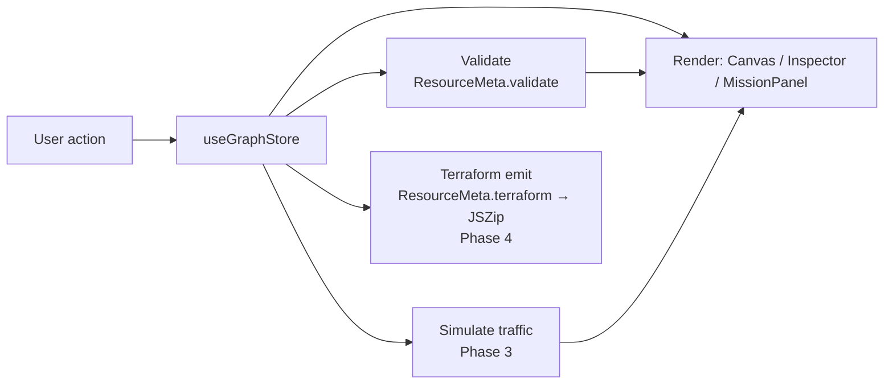

# Architecture

> **Draft.** This reflects the Phase 0 skeleton. It will be refined as
> simulation (Phase 3) and export (Phase 4) land.

## Overview

cidrunner is a client-only single-page app. There is no backend: the entire
editor, simulator, and Terraform generator run in the browser, and the build is
served as static files (Cloudflare Pages). State lives in memory in a single
Zustand store; nothing is persisted server-side.

The user builds an AWS topology as a graph of nodes (resources) and edges
(connections), optionally under a mission's win condition, then exports the
result as Terraform.

## Component map

```
App
└─ Layout                     3-pane shell
   ├─ Palette         (left)    draggable list of the 10 resource types
   ├─ Canvas          (center)  React Flow editor — nodes, edges, nesting
   │  └─ ResourceNode           one node renderer, driven by ResourceMeta
   ├─ Inspector       (right)   per-resource property form (Phase 2)
   ├─ MissionPanel    (right)   mission cards, active-mission state
   └─ Toolbar         (top)     mode toggle · Start (sim) · Export (tf)
```

| Component | Responsibility |
| --------- | -------------- |
| **Palette** | Lists `resourceList`; source of drag-and-drop node creation. |
| **Canvas** | Wraps React Flow; owns node/edge interaction, nesting, and (later) edge-rule enforcement. |
| **ResourceNode** | Generic node view; looks up its `ResourceMeta` by `data.type` to render icon, label, and accent. |
| **Inspector** | Edits the selected node's `data.config`; runs `ResourceMeta.validate` (Phase 2). |
| **MissionPanel** | Shows missions; sets `activeMissionId`; displays clear state (Phase 5). |
| **Toolbar** | Free/Challenge mode toggle; Start (Phase 3) and Export (Phase 4) actions. |

## State management

A single Zustand store, [`src/store/useGraphStore.ts`](../src/store/useGraphStore.ts),
is the source of truth:

- `mode` — `'free' | 'challenge'`
- `nodes` / `edges` — the React Flow graph (`nodes` typed as `ResourceNodeType`)
- `selectedNodeId` — drives the Inspector
- `activeMissionId` — drives the MissionPanel

Nodes carry a typed `data` payload:

```ts
interface NodeData {
  type: ResourceType                 // which resource this block is
  label: string                      // display label
  config: Record<string, unknown>    // editable settings (seeded from defaults)
}
```

Nesting uses React Flow's native `parentId` + `extent: 'parent'` (a Subnet's
`parentId` is its VPC, and so on).

## Resource registry

[`src/resources/`](../src/resources/) holds one module per resource plus an
`index.ts` registry. Each resource is a `ResourceMeta` describing everything the
rest of the app needs to know about it — so the UI, validator, and Terraform
emitter stay data-driven rather than hard-coded per resource:

```ts
interface ResourceMeta {
  type: ResourceType
  label: string
  description: string
  icon: LucideIcon
  color: string
  defaults: Record<string, unknown>
  terraform: (id, config) => string        // Phase 4 — stubbed
  validate?: (config) => string[]          // Phase 2/3 — optional
}
```

The MVP set is fixed at **10** resources — see
[ADR 0001](decisions/0001-mvp-scope-and-resource-list.md).

## Mission registry

[`src/missions/`](../src/missions/) holds one module per mission
(`tutorial`, `threeTier`, `serverless`) plus an `index.ts`. A `Mission`
describes its `goal`, optional `hint`, and `requiredResources` used by the
Phase 3+ clear check.

## Data flow



1. A user action (drag, connect, edit, select) dispatches a store mutation.
2. The store update re-renders the affected panes.
3. Validation runs against the changed config and feeds error state back to the UI.
4. **Start** walks the graph topology to animate traffic and detect broken paths.
5. **Export** maps each node through its `terraform()` emitter, resolves
   dependencies from the graph topology (e.g. a Subnet's `vpc_id` from its
   parent), and zips the result — see
   [ADR 0005](decisions/0005-terraform-generation-approach.md).
