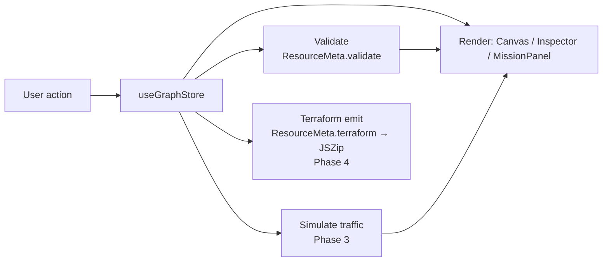

# Architecture

> Reflects the MVP (Phases 0–5): editor, property validation, traffic
> simulation, Terraform export, and the mission system.

## Overview

cidrunner is a client-only single-page app. There is no backend: the entire
editor, simulator, and Terraform generator run in the browser, and the build is
served as static files (GitHub Pages, under `/cidrunner/` — see
[ADR 0007](decisions/0007-github-pages-over-cloudflare.md)). State lives in memory in a single
Zustand store; nothing is persisted server-side.

The user builds an AWS topology as a graph of nodes (resources) and edges
(connections), optionally under a mission's win condition, then exports the
result as Terraform.

The UI language is **Korean**, hardcoded — no i18n framework. AWS resource names
and technical terms (VPC, Subnet, EC2, …) stay in English to match the AWS
console and docs. See [ADR 0008](decisions/0008-korean-first-ui-no-i18n.md).

## Component map

```
App
└─ Layout                     responsive shell (3-pane ≥md / drawers <md)
   ├─ Palette         (left)    draggable list of the 20 resource types
   ├─ Canvas          (center)  React Flow editor — nodes, edges, nesting
   │  └─ ResourceNode           one node renderer, driven by ResourceMeta
   ├─ Inspector       (right)   per-resource property form (Phase 2)
   ├─ MissionPanel    (right)   mission cards, active-mission state
   ├─ Toolbar         (top)     mode toggle · Start (sim) · Export (tf) — desktop only
   ├─ MobileHeader    (top)     <md drawer triggers (palette · missions · inspector)
   └─ Drawer          (<md)     overlay/bottom-sheet host for the three panels
```

| Component | Responsibility |
| --------- | -------------- |
| **Palette** | Lists `resourceList`; source of drag-and-drop node creation. |
| **Canvas** | Wraps React Flow; owns node/edge interaction, nesting, and (later) edge-rule enforcement. |
| **ResourceNode** | Generic node view; looks up its `ResourceMeta` by `data.type` to render icon, label, and accent. |
| **Inspector** | Edits the selected node's `data.config`; runs `ResourceMeta.validate` (Phase 2). |
| **MissionPanel** | Shows missions; sets `activeMissionId`; displays clear state (Phase 5). |
| **Toolbar** | Free/Challenge mode toggle; Start (Phase 3) and Export (Phase 4) actions. Desktop only (`hidden md:block`). |
| **MobileHeader** | `md:hidden` header buttons that open the palette / missions / inspector drawers. |
| **Drawer** | Self-contained overlay/bottom-sheet used to host the three panels below `md`. |

## Responsive strategy

The layout has two shells split at Tailwind's default `md` breakpoint (768px);
see [ADR 0009](decisions/0009-mobile-responsive-drawer-pattern.md).

- **≥768px (desktop)** — the static 3-pane layout above: Palette (left) /
  Canvas (center) / Inspector + MissionPanel (right).
- **<768px (mobile)** — Canvas fills the viewport (React Flow's built-in touch
  pan/zoom carries the "view" experience). The three panels become overlay
  drawers: Palette (left), Inspector (right), MissionPanel (bottom sheet,
  `max-h-[70vh]`), each opened from a `MobileHeader` button. Selecting a node
  auto-opens the Inspector drawer.

Each panel splits its inner content (`PaletteBody` / `InspectorBody` /
`MissionList`) from its desktop `aside` wrapper, so the desktop pane and the
mobile drawer render the same content with no duplication. Drawer open/close
state lives in the store as `mobileDrawers` + `setDrawer`.

The `Drawer` animates with **pure CSS transitions**, not Framer Motion: it stays
mounted and, when closed, is translated off-screen *and* `pointer-events-none`,
so a closed drawer can never intercept canvas taps regardless of animation
state. (An `AnimatePresence` version left a tap-blocking ghost overlay under
React 19 StrictMode — see the ADR.)

## State management

A single Zustand store, [`src/store/useGraphStore.ts`](../src/store/useGraphStore.ts),
is the source of truth:

- `mode` — `'free' | 'challenge'`
- `nodes` / `edges` — the React Flow graph (`nodes` typed as `ResourceNodeType`)
- `selectedNodeId` — drives the Inspector
- `activeMissionId` — drives the MissionPanel
- `mobileDrawers` — `{ palette, inspector, missions }` open flags for the `<md` drawers (`setDrawer`)
- `notice` — transient player-facing message for a rejected drop/edge (`setNotice`)

Nodes carry a typed `data` payload:

```ts
interface NodeData {
  type: ResourceType                 // which resource this block is
  label: string                      // display label
  config: Record<string, unknown>    // editable settings (seeded from defaults)
}
```

Nesting uses React Flow's native `parentId` + `extent: 'parent'` (a Subnet's
`parentId` is its VPC, and so on).

**Persistence & sharing** ([ADR 0020](decisions/0020-save-and-share.md)): the
store is wrapped in zustand's `persist` — durable design state
(`nodes`/`edges`/`mode`/`activeMissionId`) autosaves to localStorage (versioned,
with a migrate hook); transient UI never persists. Designs also serialize to a
versioned JSON snapshot carried in a shareable `#g=` URL fragment or a
downloadable `.json` file; incoming snapshots are rebuilt field-by-field from a
whitelist ([`src/graph/share.ts`](../src/graph/share.ts)). Graph modules are
unit-tested with Vitest in CI ([ADR 0021](decisions/0021-test-safety-net.md)).

## Resource registry

[`src/resources/`](../src/resources/) holds one module per resource plus an
`index.ts` registry. Each resource is a `ResourceMeta` describing everything the
rest of the app needs to know about it — so the UI, validator, and Terraform
emitter stay data-driven rather than hard-coded per resource:

```ts
interface ResourceMeta {
  type: ResourceType
  label: string
  description: string
  icon: LucideIcon
  color: string
  defaults: Record<string, unknown>
  allowedParents: (ResourceType | 'canvas')[] // where it may be placed (nesting)
  container?: boolean                          // holds child nodes (VPC, Subnet)
  defaultSize?: { width; height }              // container size on create
  connectsTo?: ResourceType[]                  // directional edge targets
  fields?: PropertyField[]                     // Inspector form descriptor (Phase 2)
  terraform: (ctx: TfContext) => string        // apply-ready HCL (ADR 0016)
  validate?: (config) => string[]              // real-time validation (Phase 2)
}
```

The resource set is **20** blocks — the 10-block MVP set (ADR 0001) plus expansion
batch 1 ([ADR 0022](decisions/0022-resource-expansion-batch-1.md): DynamoDB,
CloudFront, Route 53, SQS) and batch 2 ([ADR 0026](decisions/0026-resource-expansion-2.md):
ECS, EKS, ElastiCache, EFS, SNS, CloudWatch).

## Property editing & validation

The Inspector's form is data-driven (Phase 2): `PropertyForm` reads a resource's
`fields` (`text` / `number` / `boolean` / `select`) and writes edits back through
the store's `updateNodeConfig`. `ResourceMeta.validate` runs on every render for
real-time feedback — errors show as a red badge + message list in the Inspector
and a red outline on the node. Reusable checks live in
[`src/resources/validators.ts`](../src/resources/validators.ts). Security Group
rules are simplified to inbound toggles — see
[ADR 0011](decisions/0011-inspector-property-form-and-validation.md).

On top of per-node checks, [`src/graph/checks.ts`](../src/graph/checks.ts) runs
**graph-level validation with two severities** (memoized per store snapshot):

- **Errors (red)** — configurations AWS/Terraform would reject: CIDR
  containment/sibling-overlap ([`src/graph/cidr.ts`](../src/graph/cidr.ts),
  [ADR 0015](decisions/0015-graph-level-cidr-validation.md)), a NAT outside a
  public subnet, an ALB or RDS without the multi-AZ subnets it requires.
- **Warnings (amber)** — apply-able but insecure / non-best-practice: SSH open
  to 0.0.0.0/0, a DB in a public subnet, disabled encryption or S3
  public-access block, a missing Security Group attachment.

Both feed the node outline, the Inspector badge + message lists (⚠ red / 🛡
amber), and the mission context (`allValid`, `securityOk`) — see
[ADR 0017](decisions/0017-security-model-and-severity-validation.md).

## Graph rules

Nesting and edge constraints (Phase 1) are **data-driven**, derived entirely
from the `ResourceMeta` fields above so the canvas carries no per-resource
branching. [`src/graph/rules.ts`](../src/graph/rules.ts) exposes the derived
predicates — `canContain`, `canBeTopLevel`, `canConnect`, `canBeSource`,
`canBeTarget` — used by the canvas and node renderer:

- **Nesting** — a drop resolves the innermost container under the pointer whose
  type is in the dropped resource's `allowedParents`; if none matches it falls
  back to top level (when `'canvas'` is allowed) or is rejected. React Flow's
  native `parentId` + `extent: 'parent'` then keep children within their parent.
- **Edges** — a connection `source → target` is allowed only when the source's
  `connectsTo` lists the target's type; connection handles are rendered only
  where a node may be an edge source and/or target.
- **Feedback** — a rejected drop or edge sets a transient `notice` string in the
  store, surfaced as a toast over the canvas.

See [ADR 0010](decisions/0010-graph-nesting-and-edge-rule-model.md).

## Traffic simulation (playback)

Pressing **Start** runs [`src/graph/simulate.ts`](../src/graph/simulate.ts): one
greedy trace per **entry point** (every ALB, every Lambda with no inbound
traffic) along the traffic edges to a sink (RDS or S3). Two edge kinds carry no
traffic and are skipped: Security-Group *attachments* (dashed rose,
[ADR 0017](decisions/0017-security-model-and-severity-validation.md)) and
RDS → RDS *replication links* (dashed indigo, target shows a `REPLICA` badge and
emits `replicate_source_db` —
[ADR 0019](decisions/0019-rds-read-replica-as-edge.md)).
The `SimResult` carries `flows[]` plus derived aggregates (`edgeHops`,
`arrivals`, `blockedNodeIds`). Playback: SVG particles staggered per hop
(0.45s), a green **arrival pulse** when the request reaches each node (data
lands), red pulses on blocking nodes, and a banner listing every flow with its
outcome. See [ADR 0012](decisions/0012-traffic-simulation-model.md) and
[ADR 0018](decisions/0018-multi-flow-playback-and-palette-categories.md).

## Terraform export

**Export** runs [`src/graph/terraform.ts`](../src/graph/terraform.ts) and is
**apply-ready** ([ADR 0016](decisions/0016-apply-ready-terraform.md), extending
[ADR 0013](decisions/0013-terraform-export-implementation.md)). Each resource
owns its HCL via `ResourceMeta.terraform(ctx)`; the generator resolves `refs`
(enclosing VPC/subnet, public subnets, SG attachments and ALB targets from
edges) and **derives the plumbing the canvas doesn't draw**: route tables +
associations (IGW → public, NAT → private), DB subnet groups, the Amazon Linux
2023 AMI lookup, and Lambda's IAM role + inline package + full API Gateway
chain. Output: `main.tf` / `variables.tf` / `outputs.tf` / `README.md` zipped
via JSZip. Verified with a real `terraform init` + `validate` (v1.9.8, AWS
provider 5.x + archive provider).

## Mission registry

[`src/missions/`](../src/missions/) holds one module per mission (10 total:
`tutorial`, `threeTier`, `serverless`, `staticCdn`, `asyncPipeline`,
`containerWorkload`, `globalWeb`, `eventDriven`, `securityHardening`,
`disasterRecovery` — see [ADR 0027](decisions/0027-mission-expansion-2.md)) plus
an `index.ts`. A `Mission`
describes its `goal`, optional `hint`, `requiredResources`, and a `check(ctx)`
that returns a 0–3 star rating (0 = not cleared) for the current graph. The
MissionPanel builds the check context live — the multi-flow simulation result,
`allValid` (no errors) and `securityOk` (no security warnings) — so cards show
clear state and stars as the graph changes. See
[ADR 0014](decisions/0014-mission-clear-detection-and-stars.md).

## Data flow



1. A user action (drag, connect, edit, select) dispatches a store mutation.
2. The store update re-renders the affected panes.
3. Validation runs against the changed config and feeds error state back to the UI.
4. **Start** walks the graph topology to animate traffic and detect broken paths.
5. **Export** maps each node through its `terraform()` emitter, resolves
   dependencies from the graph topology (e.g. a Subnet's `vpc_id` from its
   parent), and zips the result — see
   [ADR 0005](decisions/0005-terraform-generation-approach.md).

## Build & performance

The production build ships as split chunks rather than one bundle
([ADR 0029](decisions/0029-perf-code-splitting.md)). `vite.config.ts` configures
rolldown's `codeSplitting.groups` to isolate `react-flow` and a catch-all
`vendor` chunk, keeping every chunk under the 500 kB warning threshold. Code only
needed on demand is lazy-loaded: **JSZip** (`await import('jszip')` inside the
Terraform export path) and the **Onboarding**, **ShortcutHelp**, and
**NodeContextMenu** components (`React.lazy`). On the canvas, React Flow runs with
`onlyRenderVisibleElements` so off-viewport nodes are culled and large graphs
(100+ nodes) stay responsive on pan/zoom.

Global keyboard shortcuts live in `useKeyboardShortcuts` (mounted inside the
`ReactFlowProvider` so `R`/fit-view reaches the flow instance); all editing
actions mutate only `nodes`/`edges`, so they ride the existing zundo undo history
for free — see [ADR 0028](decisions/0028-keyboard-shortcuts-and-context-menu.md).
